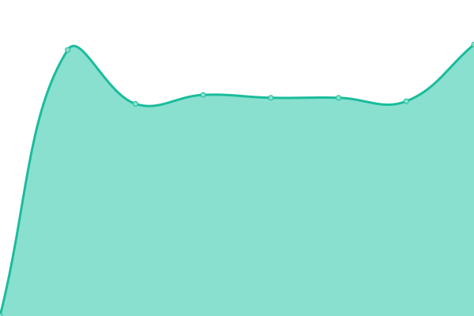

# [📈 Live Status](https://demo.upptime.js.org): <!--live status--> **🟩 All systems operational**

This repository contains the open-source uptime monitor and status page for [renzo1087](https://demo.upptime.js.org), powered by [Upptime](https://github.com/upptime/upptime).

With [Upptime](https://upptime.js.org), you can get your own unlimited and free uptime monitor and status page, powered entirely by a GitHub repository. We use [Issues](https://github.com/renzoalis/upptime/issues) as incident reports, [Actions](https://github.com/renzoalis/upptime/actions) as uptime monitors, and [Pages](https://demo.upptime.js.org) for the status page.

<!--start: status pages-->
<!-- This summary is generated by Upptime (https://github.com/upptime/upptime) -->
<!-- Do not edit this manually, your changes will be overwritten -->
<!-- prettier-ignore -->
| URL | Status | History | Response Time | Uptime |
| --- | ------ | ------- | ------------- | ------ |
|  [WEB](https://oceba.gba.gov.ar) | 🟩 Up | [web.yml](https://github.com/renzoalis/upptime/commits/HEAD/history/web.yml) | 

 1715ms
     
 | 

<a href="https://renzoalis.github.io/upptime/history/web">100.00%</a>
    

|  [Intranet](https://oceba.gba.gov.ar/intranet) | 🟩 Up | [intranet.yml](https://github.com/renzoalis/upptime/commits/HEAD/history/intranet.yml) | 

 1703ms
     
 | 

<a href="https://renzoalis.github.io/upptime/history/intranet">100.00%</a>
    

|  [Extranet](https://oceba.gba.gov.ar/extranet) | 🟩 Up | [extranet.yml](https://github.com/renzoalis/upptime/commits/HEAD/history/extranet.yml) | 

 1349ms
     
 | 

<a href="https://renzoalis.github.io/upptime/history/extranet">100.00%</a>
    

|  [Servidor de Archivos](https://oceba.gba.gov.ar/intranet/reclamos/adjuntos/3/seia-1638550850.png) | 🟩 Up | [servidor-de-archivos.yml](https://github.com/renzoalis/upptime/commits/HEAD/history/servidor-de-archivos.yml) | 

 2361ms
     
 | 

<a href="https://renzoalis.github.io/upptime/history/servidor-de-archivos">100.00%</a>
    

<!--end: status pages-->

[**Visit our status website →**](https://demo.upptime.js.org)

## 📄 License

- Powered by: [Upptime](https://github.com/upptime/upptime)
- Code: [MIT](./LICENSE) © [renzo1087](https://demo.upptime.js.org)
- Data in the `./history` directory: [Open Database License](https://opendatacommons.org/licenses/odbl/1-0/)
